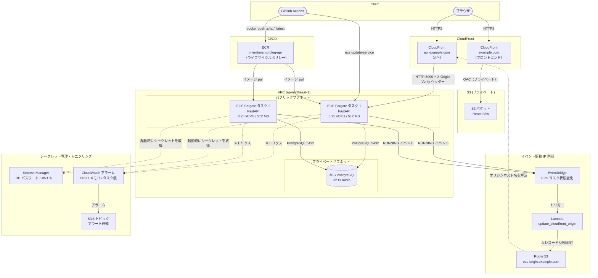

# Membership Blog on ECS

AWS 上にデプロイされたフルスタックの会員制ブログアプリケーションです。Application Load Balancer と NAT Gateway を使わないコスト最適化アーキテクチャを採用しています。

**公開 URL:** https://kamotaka.net/docs (yourdomain)

[English version](README.md)

---

## アーキテクチャ



---

## 設計上の判断

### Application Load Balancer を使わない理由

標準的な ECS 構成では ALB をエントリーポイントとして使用しますが、月額約 $16 のコストがかかります。本プロジェクトでは **CloudFront をエントリーポイント**として使用し、ECS タスクの動的 IP 問題は Lambda と Route 53 の自動更新で解決しています。

**削減コスト: 約 $16/月**

> **トレードオフ:** 2 台のタスクがあっても ALB がないため、Route 53 が現在向いているタスクのみがトラフィックを受信します。2 台目のタスクはローリングデプロイ中の可用性維持が主な目的です。ECS が旧タスクを停止する際、新タスクの RUNNING イベントが Lambda をトリガーして DNS を更新するため、ダウンタイムはほぼゼロになります。

### NAT Gateway を使わない理由

ECS タスクをパブリックサブネットに配置してパブリック IP を付与することで、NAT Gateway なしで直接インターネットにアクセスできます（ECR イメージ pull、AWS API 呼び出しなど）。NAT Gateway は月額約 $32 かかりますが、このワークロードには不要です。

**削減コスト: 約 $32/月**

### 動的オリジン解決の仕組み

ECS Fargate タスクは再起動のたびに新しいパブリック IP が割り当てられるため、CloudFront のオリジンを自動更新する仕組みが必要です。

1. ECS タスク起動 → **EventBridge** に `Task State Change` イベントを送信
2. EventBridge が **Lambda 関数** をトリガー
3. Lambda が ECS/EC2 API 経由でタスクの ENI パブリック IP を取得
4. Lambda が **Route 53 A レコード**（`ecs-origin.example.com`）を新しい IP に更新
5. CloudFront がオリジンホスト名を解決して新しいタスクにトラフィックを転送

Lambda にはレースコンディション対策も実装されており、複数のタスクが同時に起動した場合（ローリングデプロイ中など）、対象タスクが `RUNNING` リストにいるかを確認してから DNS を更新します。

### クロスアカウント Route 53

Route 53 のホストゾーンは別の AWS アカウント（`your IAM User`）に存在します。Lambda は STS でクロスアカウントの IAM ロールを assume して DNS レコードを更新します。マルチアカウント構成のパターンを実践しています。

---

## セキュリティ

| レイヤー | 対策 |
|---|---|
| CloudFront → ECS | UUID シークレットを含むカスタムヘッダー `X-Origin-Verify` を検証。FastAPI が全リクエストで確認 |
| ECS セキュリティグループ | CloudFront のオリジン向け IP レンジ（AWS マネージドプレフィックスリスト）からのポート 8000 のみ許可 |
| DB 認証情報 | **Secrets Manager** に保存し、ECS タスク起動時に注入（コードや環境変数に平文で書かない） |
| JWT 署名キー | Terraform が生成した 64 文字のランダムキーを **Secrets Manager** に保存。未設定の場合はアプリが起動を拒否 |
| CI/CD 認証情報 | GitHub Actions は **OIDC** を使用（長期アクセスキーを保持しない） |
| フロントエンド S3 | プライベートバケット。CloudFront OAC 経由でのみ配信 |
| TLS | 両 CloudFront ディストリビューションに ACM 証明書。TLS 1.2 以上 |

---

## 可用性・可観測性

### ローリングデプロイ

ECS サービスは **2 タスク**で動作し、`deployment_minimum_healthy_percent = 50` を設定しています。デプロイ中は常に最低 1 台が稼働した状態を維持し、ダウンタイムをほぼゼロに抑えます。

### コンテナヘルスチェック

各タスクは 30 秒ごとに `GET /health` に対して Python ベースのヘルスチェックを実行します（distroless イメージのためシェルが使えないため）。3 回連続で失敗するとタスクが unhealthy と判定され、ECS が自動的に置き換えます。

```
startPeriod = 60s  →  interval = 30s  →  timeout = 5s  →  retries = 3
```

### CloudWatch アラーム

| アラーム | 条件 | アクション |
|---|---|---|
| CPU 高負荷 | 10 分間の平均 > 80% | SNS 通知 |
| メモリ高負荷 | 10 分間の平均 > 80% | SNS 通知 |
| タスク数低下 | 稼働タスク数 < 1 | SNS 通知（即時） |

アラートをメールで受け取るには：
```bash
aws sns subscribe \
  --topic-arn $(terraform output -raw alarm_sns_topic_arn) \
  --protocol email \
  --notification-endpoint your@email.com
```

---

## 技術スタック

| レイヤー | 技術 |
|---|---|
| フロントエンド | React 18 + Vite |
| バックエンド | FastAPI (Python) + SQLAlchemy |
| 認証 | JWT (python-jose) + bcrypt |
| データベース | PostgreSQL 15 on RDS |
| コンテナ | Docker → ECR → ECS Fargate |
| IaC | Terraform（モジュール分割） |
| CI/CD | GitHub Actions |
| DNS | Route 53 |
| CDN | CloudFront |
| イベント処理 | EventBridge + Lambda (Python 3.12) |
| モニタリング | CloudWatch Alarms + SNS |
| シークレット管理 | AWS Secrets Manager |

---

## インフラ構成

```
terraform/
├── bootstrap/          # 初回のみ: S3 バックエンド・DynamoDB・Route 53 ゾーン作成
├── envs/
│   ├── dev/            # dev 環境のエントリーポイント（main.tf, variables.tf）
│   └── prod/           # prod 環境のエントリーポイント
└── modules/
    ├── nw/             # VPC、サブネット、セキュリティグループ
    ├── ecr/            # ECR リポジトリ + ライフサイクルポリシー
    ├── ecs/            # Fargate クラスター、タスク定義、サービス、
    │                   # ヘルスチェック、ローリングデプロイ、アラーム、シークレット
    ├── rds/            # PostgreSQL インスタンス、サブネットグループ、Secrets Manager
    ├── cloudfront/     # API 用 CloudFront ディストリビューション、ACM 証明書、Route 53 レコード
    ├── frontend/       # S3 バケット、CloudFront OAC ディストリビューション、ACM、Route 53
    ├── lambda/         # オリジン更新関数、EventBridge ルール
    └── iam_oidc/       # GitHub Actions OIDC プロバイダーと IAM ロール
```

### ECR ライフサイクルポリシー

ストレージコストを抑えるため、古いイメージを自動削除します。
- **タグなしイメージ**: 1 日後に削除（`:latest` タグ上書き時に発生）
- **全イメージ**: 最新 10 件のみ保持（約 5 世代分のロールバック用）

---

## CI/CD パイプライン

```
git push → main
    │
    ├─ backend-deploy.yml（app/** の変更時に起動）
    │   ├── OIDC で認証（長期クレデンシャル不要）
    │   ├── docker build
    │   ├── docker push :$GITHUB_SHA   ← ロールバック用アンカー
    │   ├── docker push :latest
    │   └── aws ecs update-service --force-new-deployment
    │           └── ECS ローリングデプロイ（常に最低 1 台稼働）
    │                   └── EventBridge → Lambda → Route 53 更新
    │
    └─ frontend-deploy.yml（frontend/** の変更時に起動）
        ├── npm run build
        ├── aws s3 sync dist/ → S3
        └── aws cloudfront create-invalidation
```

---

## テスト

FastAPI の `TestClient` と SQLite インメモリ DB を使用した単体テストです。PostgreSQL の起動は不要です。

```bash
cd app
python -m venv .venv && source .venv/bin/activate
pip install -r requirements-dev.txt
pytest tests/ -v
```

| テストクラス | ケース数 | カバレッジ |
|---|---|---|
| `TestHealth` | 2 | 200 レスポンス、ミドルウェアスキップ確認 |
| `TestRegister` | 3 | 正常、重複メール、不正なメール形式 |
| `TestLogin` | 3 | 正常、誤パスワード、未登録ユーザー |
| `TestPosts` | 4 | 一覧取得、認証済み作成、未認証作成、作成後一覧確認 |
| `TestDeletePost` | 5 | 投稿者、他ユーザー (403)、管理者、存在しない ID (404)、未認証 (401) |

---

## 月間維持費の目安（ap-northeast-1）

| サービス | スペック | 月額 |
|---|---|---|
| RDS PostgreSQL | db.t3.micro / 20 GB | ~$22 |
| ECS Fargate | 0.25 vCPU / 512 MB × **2 タスク** / 24h | ~$18 |
| CloudFront | 2 ディストリビューション | ~$1 |
| Route 53 | ホストゾーン 1 個 | $0.50 |
| Secrets Manager | **2 シークレット**（DB + JWT） | $0.80 |
| ECR | イメージストレージ（ライフサイクル管理済み） | ~$0.50 |
| S3 | 静的ファイル | ~$0.50 |
| CloudWatch アラーム | 3 本 | $0.30 |
| CloudWatch Logs | ログ収集 | ~$1 |
| Lambda | 月間実行回数はわずか | ~$0 |
| SNS | 通知 | ~$0 |
| **合計** | | **~$44/月** |

> ALB（~$16/月）と NAT Gateway（~$32/月）は上記の設計判断により意図的に省いています。

---

## ローカル開発

### 必要なツール
- Docker
- Python 3.12 以上
- Node.js 20 以上
- PostgreSQL（または Docker）

### バックエンド

```bash
cd app
python -m venv .venv && source .venv/bin/activate
pip install -r requirements.txt

export DB_USER=postgres
export DB_PASSWORD=postgres
export DB_NAME=membership_db
export DB_HOST=localhost
export JWT_SECRET_KEY=local-dev-secret-key   # 必須（フォールバックなし）

uvicorn main:app --reload
# API ドキュメント: http://localhost:8000/docs
```

### フロントエンド

```bash
cd frontend
npm install
npm run dev
# アプリ: http://localhost:5173
```

### インフラ（Terraform）

```bash
# 初回のみ実行
cd terraform/bootstrap
terraform init && terraform apply

# dev 環境のデプロイ
cd terraform/envs/dev
terraform init
terraform plan
terraform apply
```

---

## デプロイ手順

ゼロから自分の AWS アカウントにデプロイするための完全な手順です。

### 必要なツールのインストール

```bash
# Terraform
brew install tfenv
tfenv install 1.9.0 && tfenv use 1.9.0

# AWS CLI
brew install awscli

# Node.js 20 以上
brew install node

# Python 3.12 以上
brew install python@3.12
```

---

### Step 1 — AWS 認証情報の設定

`AdministratorAccess` を持つ IAM ユーザーを作成し、名前付きプロファイルを設定します。

```bash
aws configure --profile Your-IAM-User
# AWS Access Key ID:     <アクセスキー>
# AWS Secret Access Key: <シークレットキー>
# Default region:        ap-northeast-1
# Default output format: json
```

> プロファイル名 `Your-IAM-User` は Terraform のコード全体で使用されています。別の名前にする場合は以下のファイルを変更してください：
> - `terraform/bootstrap/versions.tf`
> - `terraform/envs/dev/main.tf`

---

### Step 2 — 独自ドメインへの変更

サンプルドメイン（`example.com`）を自分のドメインに置き換えます。

| ファイル | 変更箇所 |
|---|---|
| `terraform/bootstrap/hostzone.tf` | `"example.com"` → 自分のドメイン |
| `terraform/bootstrap/state.tf` | バケット名（グローバル一意、例: `myapp-tfstate-20260101`） |
| `terraform/envs/dev/main.tf` | `bucket`、`domain_name`、`api.example.com`、`ecs-origin.example.com`、`"example.com."` |

`terraform/envs/dev/terraform.tfvars` を作成します：

```hcl
github_repo = "GitHubユーザー名/リポジトリ名"
```

---

### Step 3 — Bootstrap の実行（初回のみ）

Bootstrap は Terraform のリモートステート用 S3 バケットと Route 53 ホストゾーンを作成します。この段階ではローカルステートを使用します（S3 バックエンドはまだ存在しないため）。

```bash
cd terraform/bootstrap
terraform init
terraform apply
```

#### 3a. Route 53 のネームサーバーを確認する

Apply 完了後、ホストゾーンに割り当てられた 4 つのネームサーバーを取得します。

```bash
aws route53 list-hosted-zones-by-name \
  --dns-name your-domain.com \
  --profile Your-IAM-User \
  --query 'HostedZones[0].Id' \
  --output text | xargs -I{} aws route53 get-hosted-zone \
    --id {} \
    --profile Your-IAM-User \
    --query 'DelegationSet.NameServers' \
    --output text
```

以下のような 4 つのネームサーバーが表示されます。

```
ns-123.awsdns-45.com
ns-678.awsdns-90.net
ns-111.awsdns-22.org
ns-999.awsdns-88.co.uk
```

#### 3b. ドメインレジストラでネームサーバーを設定する

**Step 4 を実行する前に**、ドメインを Route 53 に向けておく必要があります。Step 4 の `terraform apply` では ACM 証明書を作成し DNS 検証を行いますが、Route 53 が権威 DNS になっていない場合は apply がハングして最終的にタイムアウトします。

**お名前.com の場合:**

1. [お名前.com Navi](https://navi.onamae.com/) にログイン
2. **ドメイン** → 対象ドメインの **DNS** をクリック
3. **ネームサーバーの変更** → **その他のネームサーバーを使う** を選択
4. 上記 4 つのネームサーバーをすべて入力して保存

**Namecheap の場合:**

1. Domain List → Manage → Nameservers
2. **Custom DNS** を選択
3. 4 つのネームサーバーを追加して保存

**GoDaddy の場合:**

1. My Products → DNS → Nameservers → Change
2. **I'll use my own nameservers** を選択
3. 4 つのネームサーバーを入力して保存

#### 3c. DNS 伝播を確認する

ネームサーバーの変更が反映されるまで待ちます（通常 30 分〜数時間、最大 48 時間）。

```bash
# Route 53 のネームサーバーが返ってくれば OK
dig NS your-domain.com +short

# ブラウザで世界中の伝播状況を確認
# https://www.whatsmydns.net/#NS/your-domain.com
```

期待する出力（例）：

```
# 例 — 実際のネームサーバーは異なります
ns-123.awsdns-45.com.
ns-678.awsdns-90.net.
ns-111.awsdns-22.org.
ns-999.awsdns-88.co.uk.
```

> **上記の出力が確認できるまで Step 4 に進まないでください。**  
> ACM 証明書の DNS 検証は Route 53 が権威 DNS になっていることが前提です。伝播完了前に `terraform apply` を実行すると、apply がハングしてタイムアウトします。

---

### Step 4 — インフラのデプロイ

`envs/dev` モジュールで全アプリケーションインフラをデプロイします。Step 3 で作成した S3 バックエンドを使用します。

```bash
cd terraform/envs/dev
terraform init
terraform plan
terraform apply
```

Apply が成功したら、次のステップで使用する出力値を確認します。

```
github_actions_role_arn             = "arn:aws:iam::xxxxxxxxxxxx:role/github-actions-oidc-role"
frontend_s3_bucket_name             = "your-domain-com"
frontend_cloudfront_distribution_id = "XXXXXXXXXXXXX"
alarm_sns_topic_arn                 = "arn:aws:sns:ap-northeast-1:xxxxxxxxxxxx:membership-blog-ecs-alarms"
```

ECR リポジトリ名は `membership-blog-api` で固定です。

---

### Step 5 — GitHub Actions シークレットの設定

GitHub リポジトリの **Settings → Secrets and variables → Actions** で以下のシークレットを追加します。

| シークレット名 | 値 | 取得方法 |
|---|---|---|
| `AWS_ROLE_ARN` | `arn:aws:iam::xxxx:role/github-actions-oidc-role` | `terraform output github_actions_role_arn` |
| `ECR_REPOSITORY` | `membership-blog-api` | 固定値 |
| `S3_BUCKET_NAME` | `your-domain-com` | `terraform output frontend_s3_bucket_name` |
| `CLOUDFRONT_DISTRIBUTION_ID` | `XXXXXXXXXXXXX` | `terraform output frontend_cloudfront_distribution_id` |

---

### Step 6 — 初回デプロイ

`main` ブランチに push して両パイプラインを起動します。

```bash
git push origin main
```

GitHub Actions が以下を実行します：
1. Docker イメージをビルドして ECR に push（`:$GITHUB_SHA` と `:latest`）
2. ECS Fargate にデプロイ（`ecs update-service`）
3. React フロントエンドをビルドして S3 に同期
4. CloudFront キャッシュを無効化

ECS タスクの起動状況を確認するには：

```bash
aws ecs describe-services \
  --cluster membership-blog-cluster \
  --services membership-blog-service \
  --query 'services[0].{running:runningCount,desired:desiredCount,status:status}'
```

---

### Step 7 — アラート通知の設定（任意）

```bash
aws sns subscribe \
  --topic-arn $(cd terraform/envs/dev && terraform output -raw alarm_sns_topic_arn) \
  --protocol email \
  --notification-endpoint your@email.com
```

受信したメールから購読を確認してください。

---

### 削除手順

```bash
# アプリケーションインフラをすべて削除
cd terraform/envs/dev
terraform destroy

# Bootstrap リソースを削除（S3 バケット・DynamoDB・Route 53 ゾーン）
cd terraform/bootstrap
terraform destroy
```

---

## リポジトリ構成

```
.
├── app/                    # FastAPI バックエンド
│   ├── main.py             # ルーティング、ミドルウェア
│   ├── auth.py             # JWT + bcrypt
│   ├── module.py           # SQLAlchemy モデル（User、Post）
│   ├── schemas.py          # Pydantic スキーマ
│   ├── database.py         # DB セッション
│   ├── requirements.txt
│   ├── requirements-dev.txt  # pytest、httpx
│   ├── Dockerfile          # distroless マルチステージビルド
│   └── tests/
│       ├── conftest.py     # SQLite フィクスチャ、依存関係オーバーライド
│       └── test_api.py     # 19 テストケース
├── frontend/               # React + Vite フロントエンド
├── lambda/
│   └── update_cloudfront_origin/
│       └── index.py        # ECS IP → Route 53 同期
├── terraform/              # インフラのコード（IaC）
└── .github/workflows/      # CI/CD パイプライン
```
