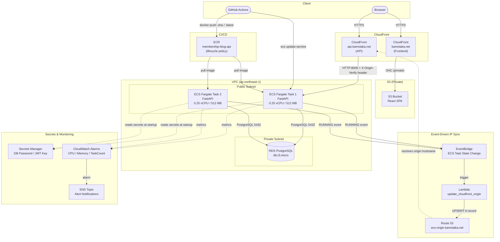

# Membership Blog on ECS

A full-stack membership blog application deployed on AWS, featuring a cost-optimized serverless-adjacent architecture that eliminates the need for an Application Load Balancer and NAT Gateway.

**Live:** https://kamotaka.net

[日本語版はこちら](README.ja.md)

---

## Architecture



---

## Architecture Decision Records

The central design goal was to run a production-grade ECS workload at the lowest possible cost without sacrificing security or availability. Two standard components — the Application Load Balancer and the NAT Gateway — were identified as the largest avoidable expenses and eliminated through deliberate architectural choices.

### Cost: Standard vs. This Architecture

| Service | Standard ECS Setup | This Project | Saving |
|---|---|---|---|
| Application Load Balancer | ~$16/month | $0 | -$16 |
| NAT Gateway | ~$32/month | $0 | -$32 |
| ECS Fargate (2 tasks) | ~$18/month | ~$18/month | — |
| RDS PostgreSQL | ~$22/month | ~$22/month | — |
| CloudFront (2 distributions) | ~$1/month | ~$1/month | — |
| Other (Route 53, S3, Lambda…) | ~$3/month | ~$3/month | — |
| **Total** | **~$92/month** | **~$44/month** | **~52% reduction** |

---

### ADR 1 — Replace ALB with CloudFront + Event-Driven DNS

**Context**

A standard ECS deployment uses an Application Load Balancer (~$16/month) as the stable, load-balanced entry point for Fargate tasks. For a low-traffic application, the ALB cost exceeds the compute cost itself.

**Decision**

Use CloudFront as the entry point and solve the dynamic IP problem with a Lambda function that automatically updates a Route 53 A record whenever an ECS task starts.

1. ECS task starts → emits a `Task State Change` event to **EventBridge**
2. EventBridge triggers a **Lambda function**
3. Lambda fetches the new task's public IP via the ECS/EC2 APIs
4. Lambda upserts the **Route 53 A record** (`ecs-origin.kamotaka.net`) to the new IP
5. CloudFront resolves the origin hostname and routes traffic to the active task

Lambda also handles a **race condition**: if multiple tasks start simultaneously during a rolling deploy, it verifies the triggering task is still in the `RUNNING` list before updating DNS.

**Trade-offs accepted**

- With 2 tasks and no ALB, only the task whose IP is currently in Route 53 receives live traffic. The second task acts as a warm standby during rolling deploys — when ECS terminates the old task, the new task's RUNNING event triggers the Lambda→DNS update, keeping downtime near zero.
- ALB would provide true active-active load balancing across both tasks. This architecture trades that capability for a ~$16/month saving, which is acceptable for a non-high-traffic workload.

---

### ADR 2 — Place ECS Tasks in Public Subnets (No NAT Gateway)

**Context**

ECS Fargate tasks need outbound internet access to pull images from ECR, call AWS APIs (Secrets Manager, ECS, EC2), and emit logs to CloudWatch. The standard approach routes this traffic through a NAT Gateway in a public subnet (~$32/month base + data transfer).

**Decision**

Place ECS tasks directly in public subnets and assign them public IPs. This gives tasks direct outbound internet access at no additional cost.

**Trade-offs accepted**

- Tasks are directly reachable from the internet on their public IPs. This is mitigated by the security group, which allows inbound traffic only from [CloudFront's managed prefix list](https://docs.aws.amazon.com/AmazonCloudFront/latest/DeveloperGuide/LocationsOfEdgeServers.html) on port 8000 — not from the public internet at large.
- A NAT Gateway would add an extra layer of network isolation. For this workload, the security group + CloudFront header verification provides equivalent protection without the cost.

---

### ADR 3 — Validate CloudFront Origin with a Shared Secret Header

**Context**

Because ECS tasks have public IPs, a request could bypass CloudFront and hit the API directly — circumventing WAF rules, TLS policies, and access controls applied at the CDN layer.

**Decision**

CloudFront injects a custom header (`X-Origin-Verify: <uuid>`) on every request. FastAPI validates this header as middleware before any route handler runs. The secret is generated by Terraform and stored in Secrets Manager; the ECS task fetches it at startup.

**Trade-offs accepted**

- This is a shared-secret pattern, not mutual TLS. It is simpler to operate and sufficient for this threat model. The secret rotates with each `terraform apply`.

---

### ADR 4 — Cross-Account Route 53

**Context**

The Route 53 hosted zone lives in a separate AWS account from the ECS workload, reflecting a common enterprise pattern where DNS is managed centrally.

**Decision**

The Lambda function assumes a cross-account IAM role via STS (`sts:AssumeRole`) to update the DNS record in the separate account. This demonstrates multi-account AWS access patterns without requiring any long-lived credentials in the workload account.

---

## Security

| Layer | Mechanism |
|---|---|
| CloudFront → ECS | Custom header `X-Origin-Verify` with a UUID secret; FastAPI validates on every request |
| ECS Security Group | Allows port 8000 only from CloudFront origin-facing IP ranges (AWS Managed Prefix List) |
| DB credentials | Stored in **Secrets Manager**; injected into ECS task at runtime |
| JWT signing key | 64-char random key generated by Terraform, stored in **Secrets Manager**; app refuses to start if unset |
| CI/CD credentials | GitHub Actions uses **OIDC** (no long-lived access keys) |
| Frontend S3 | Private bucket; served exclusively via CloudFront OAC |
| TLS | ACM certificates on both CloudFront distributions; TLS 1.2 minimum |

---

## Availability & Observability

### Rolling Deploys
The ECS service runs **2 tasks** with `deployment_minimum_healthy_percent = 50`. During a deploy, ECS keeps at least 1 task running while the replacement task starts, achieving near-zero downtime.

### Container Health Check
Each task runs a Python-based health check (distroless image has no shell) against `GET /health` every 30 seconds. ECS marks a task unhealthy after 3 consecutive failures and replaces it automatically.

```
startPeriod = 60s  →  interval = 30s  →  timeout = 5s  →  retries = 3
```

### CloudWatch Alarms

| Alarm | Condition | Action |
|---|---|---|
| CPU High | Average > 80% for 10 min | SNS notification |
| Memory High | Average > 80% for 10 min | SNS notification |
| Task Count Low | Running tasks < 1 | SNS notification (immediate) |

Subscribe to alerts:
```bash
aws sns subscribe \
  --topic-arn $(terraform output -raw alarm_sns_topic_arn) \
  --protocol email \
  --notification-endpoint your@email.com
```

---

## Tech Stack

| Layer | Technology |
|---|---|
| Frontend | React 18 + Vite |
| Backend | FastAPI (Python) + SQLAlchemy |
| Auth | JWT (python-jose) + bcrypt |
| Database | PostgreSQL 15 on RDS |
| Container | Docker → ECR → ECS Fargate |
| IaC | Terraform (modular) |
| CI/CD | GitHub Actions |
| DNS | Route 53 |
| CDN | CloudFront |
| Event processing | EventBridge + Lambda (Python 3.12) |
| Monitoring | CloudWatch Alarms + SNS |
| Secret management | AWS Secrets Manager |

---

## Infrastructure Overview

```
terraform/
├── bootstrap/          # One-time setup: S3 backend, DynamoDB lock table, Route 53 zone
├── envs/
│   ├── dev/            # Dev environment entry point (main.tf, variables.tf)
│   └── prod/           # Prod environment entry point
└── modules/
    ├── nw/             # VPC, subnets, security groups
    ├── ecr/            # ECR repository + lifecycle policy
    ├── ecs/            # Fargate cluster, task definition, service,
    │                   # health check, rolling deploy, alarms, secrets
    ├── rds/            # PostgreSQL instance, subnet group, Secrets Manager
    ├── cloudfront/     # API CloudFront distribution, ACM certificate, Route 53 record
    ├── frontend/       # S3 bucket, CloudFront OAC distribution, ACM, Route 53
    ├── lambda/         # Origin-update function, EventBridge rule
    └── iam_oidc/       # GitHub Actions OIDC provider and IAM role
```

### ECR Lifecycle Policy
To control storage costs, images are automatically cleaned up:
- **Untagged images**: deleted after 1 day (created when `:latest` tag is overwritten)
- **All images**: only the 10 most recent are retained (~5 deployments worth of rollback history)

---

## CI/CD Pipeline

```
git push → main
    │
    ├─ backend-deploy.yml (triggered on app/** changes)
    │   ├── Authenticate via OIDC (no stored credentials)
    │   ├── docker build
    │   ├── docker push :$GITHUB_SHA   ← rollback anchor
    │   ├── docker push :latest
    │   └── aws ecs update-service --force-new-deployment
    │           └── ECS rolling deploy (min 1 task always running)
    │                   └── EventBridge → Lambda → Route 53 updated
    │
    └─ frontend-deploy.yml (triggered on frontend/** changes)
        ├── npm run build
        ├── aws s3 sync dist/ → S3
        └── aws cloudfront create-invalidation
```

---

## Testing

Unit tests cover all API endpoints using FastAPI's `TestClient` with an in-memory SQLite database — no running PostgreSQL required.

```bash
cd app
python -m venv .venv && source .venv/bin/activate
pip install -r requirements-dev.txt
pytest tests/ -v
```

| Test Class | Cases | Coverage |
|---|---|---|
| `TestHealth` | 2 | 200 response, middleware bypass |
| `TestRegister` | 3 | Success, duplicate email, invalid format |
| `TestLogin` | 3 | Success, wrong password, unknown user |
| `TestPosts` | 4 | List, authenticated create, unauthenticated create, post appears in list |
| `TestDeletePost` | 5 | Owner, other user (403), admin, non-existent (404), unauthenticated (401) |

---

## Estimated Monthly Cost (ap-northeast-1)

| Service | Spec | This Project | Standard ECS |
|---|---|---|---|
| RDS PostgreSQL | db.t3.micro / 20 GB | ~$22 | ~$22 |
| ECS Fargate | 0.25 vCPU / 512 MB × 2 tasks / 24h | ~$18 | ~$18 |
| Application Load Balancer | — | **$0** | ~$16 |
| NAT Gateway | — | **$0** | ~$32 |
| CloudFront | 2 distributions | ~$1 | ~$1 |
| Route 53 | 1 hosted zone | $0.50 | $0.50 |
| Secrets Manager | 2 secrets (DB + JWT) | $0.80 | $0.80 |
| ECR | Image storage (lifecycle managed) | ~$0.50 | ~$0.50 |
| S3 | Static assets | ~$0.50 | ~$0.50 |
| CloudWatch Alarms | 3 alarms | $0.30 | $0.30 |
| CloudWatch Logs | Log ingestion | ~$1 | ~$1 |
| Lambda / SNS | Event-driven DNS sync | ~$0 | ~$0 |
| **Total** | | **~$44/month** | **~$92/month** |

**52% cost reduction** achieved by replacing the ALB with CloudFront + event-driven DNS, and eliminating the NAT Gateway by placing tasks in public subnets with security-group-restricted inbound access. See [ADR 1](#adr-1--replace-alb-with-cloudfront--event-driven-dns) and [ADR 2](#adr-2--place-ecs-tasks-in-public-subnets-no-nat-gateway) for the rationale and trade-offs.

---

## Local Development

### Prerequisites
- Docker
- Python 3.12+
- Node.js 20+
- PostgreSQL (or Docker)

### Backend

```bash
cd app
python -m venv .venv && source .venv/bin/activate
pip install -r requirements.txt

export DB_USER=postgres
export DB_PASSWORD=postgres
export DB_NAME=membership_db
export DB_HOST=localhost
export JWT_SECRET_KEY=local-dev-secret-key   # required — no fallback

uvicorn main:app --reload
# API docs at http://localhost:8000/docs
```

### Frontend

```bash
cd frontend
npm install
npm run dev
# App at http://localhost:5173
```

### Infrastructure (Terraform)

```bash
# One-time bootstrap
cd terraform/bootstrap
terraform init && terraform apply

# Deploy dev environment
cd terraform/envs/dev
terraform init
terraform plan
terraform apply
```

---

## Deployment Guide

A complete walkthrough to deploy this project from scratch on your own AWS account.

### Prerequisites

Install the following tools:

```bash
# Terraform
brew install tfenv
tfenv install 1.9.0 && tfenv use 1.9.0

# AWS CLI
brew install awscli

# Node.js 20+
brew install node

# Python 3.12+
brew install python@3.12
```

---

### Step 1 — AWS Credentials

Create an IAM user (or use an existing account) with `AdministratorAccess`, then configure a named profile:

```bash
aws configure --profile Your-IAM-User
# AWS Access Key ID:     <your key>
# AWS Secret Access Key: <your secret>
# Default region:        ap-northeast-1
# Default output format: json
```

> The profile name `Your-IAM-User` is used throughout the Terraform code. If you prefer a different name, replace it in:
> - `terraform/bootstrap/versions.tf`
> - `terraform/envs/dev/main.tf`

---

### Step 2 — Customize for Your Domain

Replace all references to the example domain with your own domain. Files to edit:

| File | What to change |
|---|---|
| `terraform/bootstrap/hostzone.tf` | `"example.com"` → your domain |
| `terraform/bootstrap/state.tf` | bucket name (must be globally unique, e.g. `myapp-tfstate-20260101`) |
| `terraform/envs/dev/main.tf` | `bucket`, `domain_name`, `api.example.com`, `ecs-origin.example.com`, `"example.com."` |
| `terraform/envs/dev/main.tf` | `github_repo` in `variables.tf` or as a tfvars value |

Create a `terraform/envs/dev/terraform.tfvars` file:

```hcl
github_repo = "your-github-username/your-repo-name"
```

---

### Step 3 — Bootstrap (one-time only)

Bootstrap creates the S3 bucket for remote state and the Route 53 hosted zone. It uses **local state** (no remote backend yet).

```bash
cd terraform/bootstrap
terraform init
terraform apply
```

#### 3a. Get Route 53 Nameservers

After apply, retrieve the 4 nameservers assigned to your hosted zone:

```bash
aws route53 list-hosted-zones-by-name \
  --dns-name your-domain.com \
  --profile Your-IAM-User \
  --query 'HostedZones[0].Id' \
  --output text | xargs -I{} aws route53 get-hosted-zone \
    --id {} \
    --profile Your-IAM-User \
    --query 'DelegationSet.NameServers' \
    --output text
```

You will get 4 nameservers similar to:

```
ns-123.awsdns-45.com
ns-678.awsdns-90.net
ns-111.awsdns-22.org
ns-999.awsdns-88.co.uk
```

#### 3b. Set Nameservers at Your Domain Registrar

You must point your domain to Route 53 **before** running Step 4. The `terraform apply` in Step 4 creates ACM certificates that are validated via DNS — if Route 53 is not yet authoritative for your domain, the apply will hang and eventually fail.

**お名前.com:**

1. Log in to [お名前.com Navi](https://navi.onamae.com/)
2. **Domain** → click **DNS** for your domain
3. **Change Nameservers** → select **Use other nameservers**
4. Enter all 4 nameservers and save

**Namecheap:**

1. Domain List → Manage → Nameservers
2. Select **Custom DNS**
3. Add all 4 nameservers and save

**GoDaddy:**

1. My Products → DNS → Nameservers → Change
2. Select **I'll use my own nameservers**
3. Enter all 4 nameservers and save

#### 3c. Verify DNS Propagation

Wait for the nameserver change to propagate (typically 30 minutes to a few hours, up to 48 hours).

Run the following command to check propagation status:

```bash
# Returns Route 53 nameservers when propagation is complete
dig NS your-domain.com +short

# Check global propagation status via browser
# https://www.whatsmydns.net/#NS/your-domain.com
```

Expected output (e.g. for `your-domain.com`):

```
# Example — your actual nameservers will differ
ns-123.awsdns-45.com.
ns-678.awsdns-90.net.
ns-111.awsdns-22.org.
ns-999.awsdns-88.co.uk.
```

> **Do not proceed to Step 4 until the above output is confirmed.**  
> ACM certificate validation relies on DNS CNAME records that are only resolvable once Route 53 is authoritative for your domain. Running `terraform apply` before propagation completes will cause the apply to hang and eventually time out.

---

### Step 4 — Deploy Infrastructure

The `envs/dev` module deploys all application infrastructure using the S3 backend created in Step 3.

```bash
cd terraform/envs/dev
terraform init
terraform plan
terraform apply
```

After a successful apply, note the outputs — you will need them in the next step:

```
github_actions_role_arn          = "arn:aws:iam::xxxxxxxxxxxx:role/github-actions-oidc-role"
frontend_s3_bucket_name          = "your-domain-com"
frontend_cloudfront_distribution_id = "XXXXXXXXXXXXX"
alarm_sns_topic_arn              = "arn:aws:sns:ap-northeast-1:xxxxxxxxxxxx:membership-blog-ecs-alarms"
```

The ECR repository name is fixed as `membership-blog-api`.

---

### Step 5 — GitHub Actions Secrets

In your GitHub repository, go to **Settings → Secrets and variables → Actions** and add the following secrets:

| Secret name | Value | Where to get it |
|---|---|---|
| `AWS_ROLE_ARN` | `arn:aws:iam::xxxx:role/github-actions-oidc-role` | `terraform output github_actions_role_arn` |
| `ECR_REPOSITORY` | `membership-blog-api` | Fixed value |
| `S3_BUCKET_NAME` | `your-domain-com` | `terraform output frontend_s3_bucket_name` |
| `CLOUDFRONT_DISTRIBUTION_ID` | `XXXXXXXXXXXXX` | `terraform output frontend_cloudfront_distribution_id` |

---

### Step 6 — First Deployment

Push to the `main` branch to trigger both pipelines:

```bash
git push origin main
```

GitHub Actions will:
1. Build the Docker image and push to ECR (`:$GITHUB_SHA` and `:latest`)
2. Deploy to ECS Fargate (`ecs update-service`)
3. Build the React frontend and sync to S3
4. Invalidate the CloudFront cache

Monitor the ECS task startup in the AWS Console or via CLI:

```bash
aws ecs describe-services \
  --cluster membership-blog-cluster \
  --services membership-blog-service \
  --query 'services[0].{running:runningCount,desired:desiredCount,status:status}'
```

---

### Step 7 — Subscribe to Alerts (optional)

```bash
aws sns subscribe \
  --topic-arn $(cd terraform/envs/dev && terraform output -raw alarm_sns_topic_arn) \
  --protocol email \
  --notification-endpoint your@email.com
```

Confirm the subscription via the email you receive.

---

### Teardown

```bash
# Remove all application infrastructure
cd terraform/envs/dev
terraform destroy

# Remove bootstrap resources (S3 bucket, DynamoDB, Route 53 zone)
cd terraform/bootstrap
terraform destroy
```

---

## Repository Structure

```
.
├── app/                    # FastAPI backend
│   ├── main.py             # Routes, middleware
│   ├── auth.py             # JWT + bcrypt
│   ├── module.py           # SQLAlchemy models (User, Post)
│   ├── schemas.py          # Pydantic schemas
│   ├── database.py         # DB session
│   ├── requirements.txt
│   ├── requirements-dev.txt  # pytest, httpx
│   ├── Dockerfile          # distroless multi-stage build
│   └── tests/
│       ├── conftest.py     # SQLite fixture, dependency overrides
│       └── test_api.py     # 19 test cases
├── frontend/               # React + Vite frontend
├── lambda/
│   └── update_cloudfront_origin/
│       └── index.py        # ECS IP → Route 53 sync
├── terraform/              # All infrastructure as code
└── .github/workflows/      # CI/CD pipelines
```
